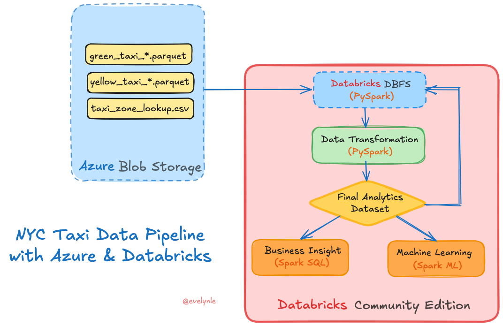
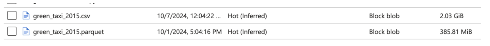
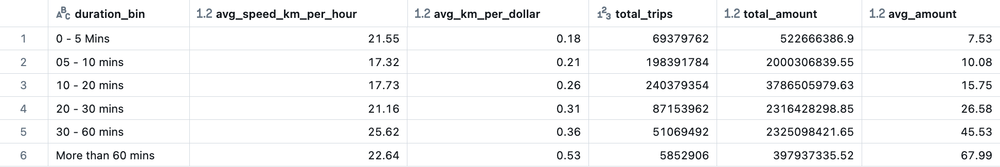
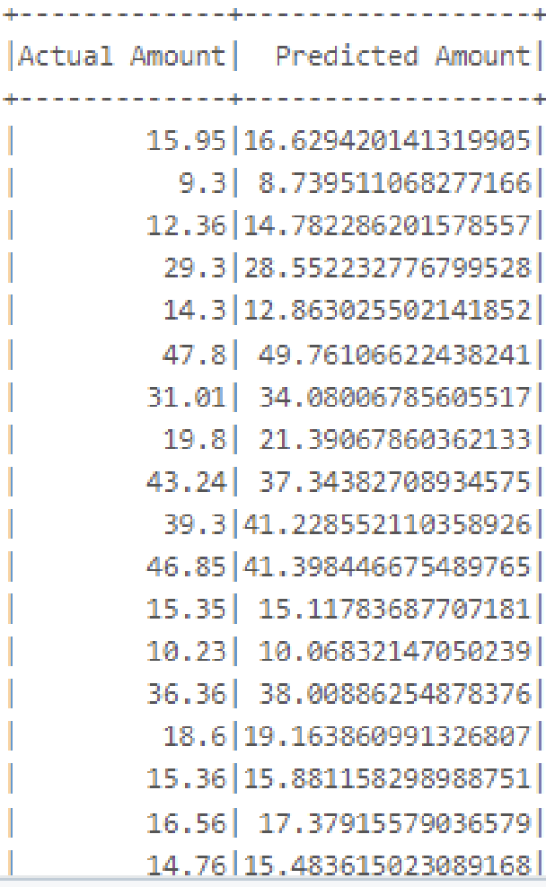

# NYC Taxi Trips Analytics with Databricks and Spark

## Introduction

This project analyzes large-scale NYC taxi trip data (2015–2022) using Databricks and Apache Spark. The primary goals are to:
- Identify high-value trips for pricing and route optimization.
- Build a machine learning model to accurately predict taxi fare amount.

  

## Tools & Technology Stack
The choice of tools is driven by the nature of the dataset: large (~14 GiB, ~730 million rows), stored in Parquet format, and requiring scalable processing.
- **Apache Spark**: Ideal for processing and querying large-scale data using distributed computing.
- **Databricks Community Edition:** Simplifies Spark workflows via notebooks with free 15GB cluster support.
- **Azure Blob Storage:** Cost-effective, scalable cloud storage with seamless Databricks integration.

 
Why Parquet Instead of CSV?

Parquet uses columnar storage with built-in compression, making it significantly smaller and faster to process.

Example: A Parquet file (385.81 MiB) vs a CSV file (2.03 GiB) for the same data.

  

 

## Project Datasets
- Sources: [NYC Yellow and Green Taxi trip data (2015–2022)](https://www.nyc.gov/site/tlc/about/tlc-trip-record-data.page)
- Volume: ~730 million rows, ~14 GiB total.
- Storage: Stored in Azure Blob Storage as Parquet files.
- Fields: Includes fare_amount, trip_distance, tip_amount, passenger_count, etc.
- Integration: Merged trip data with [location data](./data/taxi_zone_lookup.csv) via LocationID.
- Data dictionaries: [Yellow Taxi](https://www.nyc.gov/assets/tlc/downloads/pdf/data_dictionary_trip_records_yellow.pdf) & [Green Taxi](https://www.nyc.gov/assets/tlc/downloads/pdf/data_dictionary_trip_records_green.pdf)

 
Yellow Taxi Trip Data (2015–2022)

- [yellow_taxi_2015.parquet](https://drive.google.com/file/d/1owWyJDNTWyLT0ln2iK5ulkmSYvXZ7qkf/view)
- [yellow_taxi_2016.parquet](https://drive.google.com/file/d/1OdIcvpyFH1YXn9SNHc8YEuVFAYQpxCUw/view)
- [yellow_taxi_2017.parquet](https://drive.google.com/file/d/1rtEhtit_2rKvWgutXNIpSWPk3vuE6q8r/view)
- [yellow_taxi_2018.parquet](https://drive.google.com/file/d/1073SHSIkWcSESNZoU0JHXudRlSzJXPM9/view)
- [yellow_taxi_2019.parquet](https://drive.google.com/file/d/144mphzh2a6qerjLvCwwO_QHDsXTdNAJ3/view)
- [yellow_taxi_2020.parquet](https://drive.google.com/file/d/1kB5Bnx1TAXMq_revh1fyUU5RYOMdmIh4/view)
- [yellow_taxi_2021.parquet](https://drive.google.com/file/d/1eTs-ID9A3ZgYy0BotrEKwh9ThRAt8dfu/view)
- [yellow_taxi_2022.parquet](https://drive.google.com/file/d/1QdBDxHQzffBZ26T3j6Uhk1eJ8EmF0bCN/view)

 
Green Taxi Trip Data (2015–2022)

- [green_taxi_2015.parquet](https://drive.google.com/file/d/137oXWkqBOQcxmgHynPv6Wh_fHUqN40n3/view)
- [green_taxi_2016.parquet](https://drive.google.com/file/d/1s0drAVqulJ_hE4RRqMSNJWyQGF6RKAtA/view)
- [green_taxi_2017.parquet](https://drive.google.com/file/d/1-VpjWArKPEdjzlTZxI7aPwd8UsVfc2bL/view)
- [green_taxi_2018.parquet](https://drive.google.com/file/d/1jDn7qjFZ3-nrn4iOdFMh_p0W21esiIHn/view)
- [green_taxi_2019.parquet](https://drive.google.com/file/d/1BpjTq89EAhb6m-ICcZMEpTISw6jTHmio/view)
- [green_taxi_2020.parquet](https://drive.google.com/file/d/1umIMHrqaqagZYqvLLf-OzidnDPwxIY5j/view)
- [green_taxi_2021.parquet](https://drive.google.com/file/d/1ISKrR97II-zWR7f2_boFcyfsNgsj8K1Y/view)
- [green_taxi_2022.parquet](https://drive.google.com/file/d/1ysXV_4hB3Ex43k1HOvCi8RCT1k7GZANj/view)

## Project Structure

['main.ipynb'](./main.ipynb) The primary notebook that runs the entire pipeline:
- Part 1: Data Ingestion and Preparation – Load and clean the raw data.
- Part 2: Business Insights – Analyze trips for strategic decision-making.
- Part 3: Machine Learning – Build and evaluate fare prediction models.

## Business Insights

  

Optimal Trips:
- The most cost-efficient trip duration falls within 30–60 minutes, with an average fare of approximately $45.

- Although trips lasting over 60 minutes yield the highest average fare at $67.99, they represent a relatively small portion of the data — only 5.8 million trips, compared to over 51 million trips in the 30–60 minute range (around 11.37% of total trips).

- For trips in the 30–60 minute range:
    - Average speed: 25.62 km/h
    - Distance per dollar earned: 0.36 km
        → This suggests drivers can cover more distance per dollar while maintaining a steady earning rate, making this duration range highly favorable in terms of earning potential and trip efficiency.

## Machine Learning Results
- Model: Linear Regression.
- Performance: RMSE improved from 18.76 → 5.19.
- Interpretation: With an RMSE of ~$5, this model provides reliable fare predictions, enabling better revenue estimation for drivers or taxi companies and helping to optimize pricing strategies.

  

